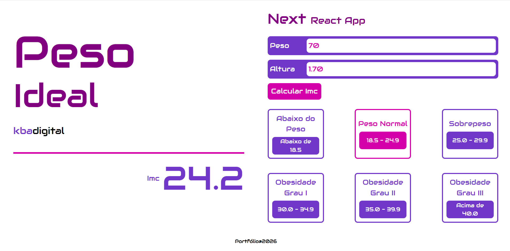

# Calculadora Imc
## Next **React App**

Acesse o aplicativo: [Calculadora IMC](https://albuquerque-katarine.github.io/next-react-calculadora-imc/)

## Objetivo

Aplicação web desenvolvida em Next.js/React para cálculo do IMC (Índice de Massa Corporal).

Permite ao usuário inserir peso e altura e obter o resultado instantaneamente.

Exibe a classificação do IMC em categorias visuais (baixo peso, normal, sobrepeso, obesidade).

Interface moderna, simples e focada em usabilidade.

## Finalidade

- Calcular o IMC de forma rápida e prática
- Classificar o resultado conforme padrões de saúde
- Facilitar a visualização das faixas de peso ideais
- Oferecer uma experiência interativa e responsiva
- Servir como projeto de portfólio demonstrando uso de Next.js e React

## Dependências

- next v.16.2.4,
- react v.19.2.4,
- react-dom v.19.2.4

## Dependências Dev

- tailwindcss/postcss v.4,
- types/node v.20,
- types/react v.19,
- types/react-dom v.19,
- eslint v.9,
- eslint-config-next v.16.2.4,
- tailwindcss v.4,
- typescript v.5

## Scripts

- dev: "next dev",
- build: "next build",
- start: "next start",
- lint: "eslint"

## Start Calculadora Imc

**Modo Desenvolvimento:** "npm run dev"

**Modo Produção:** "npm start"

## Contatos
- E-mail: [kba.2879@gmail.com](mailTo:kba.2879@gmail.com)
- Linkedin: [/katarine-albuquerque](https://www.linkedin.com/in/katarine-albuquerque/)
